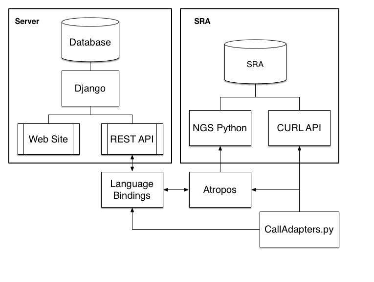

# AdapterBase

## Background

Adapters are short sequences that are attached to cDNA templates during preparation of next generation sequencing (NGS) libraries. Depending on the preparation of the NGS library and how it is sequenced, the raw NGS data may be contaminated with the adapter sequences. See [Didion et al. 2017](https://peerj.com/preprints/2452/) for more details.

Adapter trimming is a critical component of NGS data preprocessing. To trim adapters appropriately, it is necessary to know the sequences of the adapters that were used. However, adapter sequences are poorly documented and often are not included in the metadata of public database submissions ([SRA](http://www.ncbi.nlm.nih.gov/sra), [ENA](http://www.ebi.ac.uk/ena), and [DDBJ](http://www.ddbj.nig.ac.jp)).

### Target Users

Computational Biologists using data found in SRA, particular for contig generation or local reassembly.

## System Design

AdapterBase is implemented in SQLite3 and Django with the primary API implemented in REST. Lists of kits and adapter sequences have been extracted from [Illumina's documentation](https://support.illumina.com/content/dam/illumina-support/documents/documentation/chemistry_documentation/experiment-design/illumina-adapter-sequences_1000000002694-01.pdf). An initial list of runs is being populated by automatic detection of adapters using [Atropos](https://github.com/jdidion/atropos).

## Usage

Currently, AdapterBase can be accessed from the Hackathon AWS instance by mapping port 80 back to the local host. A permanent, publically facing home will be determined later.  **COMPLETE THIS SECTION**

### Local installation

If you want to spin up a local copy of AdapterBase: (**Replace with code/vignette!**)
1. Make sure python3 is installed
2. Clone or download this git repository
3. Create and enter a virtual environemnt
4. Run buildoadb.sh
5. Create a superuser for the database
6. Start the server by runnin startoadb.sha 

### Web interface vignettes

#### Get adapter sequences used by a run from the accession number

#### Deposit adapter information for a run

#### Adding new kits and/or adapter sequences

### Using the Commandline API

### Using Python bindings

## Remaining Goals

1. Complete implementation of website/API
2. Pre-populate Run database from SRA using Atropos
3. Find a home for web implementation and build Docker image
4. User group implementation and security features

### Stretch goals/post-hackathon

5. Continue building out run database with manual curation of SRA datasets
6. Integrate the AdpaterBase API into Atropos

## Project Team

AdapterBase was intitially developed as part of an NCBI-sponsored hackathon at the National Library of Medicine, August 14-16th, 2017.
- John P Didion (project lead), NHGRI/NIH, john.didion@nih.gov
- Dan Davis, Systems/Applications Architect, OCCS/AB, NLM, NIH, daniel.davis@nih.gov
- Scott Lewis, Pulmonary Critical Care Medicine, Washington University in St. Louis, slewis3827@gmail.com
- Chaim A Schramm, Vaccine Research Center, NIAID, NIH, chaim.schramm@nih.gov
- Vamsi Vungutur OCCS/AB NLM, NIH vamsi.vungutur@nih.gov
